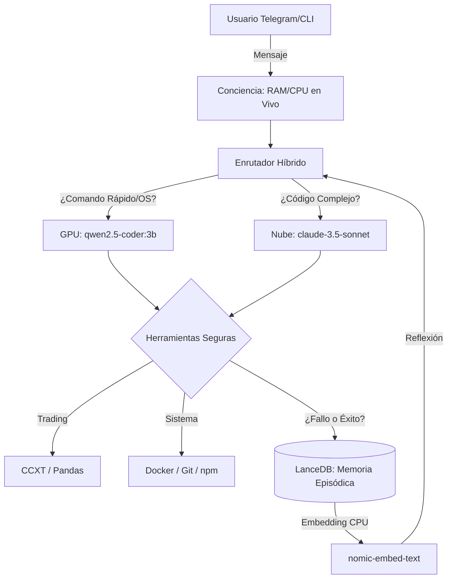

<div align="center">
  

  <h1>🧠 J.A.R.V.I.S. Nexus OS </h1>
  <p><em>Un Asistente Autónomo (AI-OS) de Ingeniería y Algorithmic Trading hiper-optimizado para 4GB VRAM.</em></p>

[](https://www.typescriptlang.org/)
[](https://nodejs.org/)
[](https://www.microsoft.com/)
[](https://www.nvidia.com/)
[](https://lancedb.com/)
[](https://ollama.com/)

</div>

---

## ⚡ La Evolución de Paisa Nexus

Originalmente bifurcado de OpenClaw, este repositorio ha sido rediseñado (Abril 2026) para convertirse en **J.A.R.V.I.S.**, un sistema operativo de inteligencia artificial consciente de su entorno, capaz de aprender de sus errores (Tool Learning) y de operar de forma segura en mercados financieros a través de Python.

Está diseñado al milímetro para exprimir una **NVIDIA RTX 3050 (4GB)** y un procesador **Ryzen 5 (32GB RAM)** sin asfixiar el sistema.

---

## 🏗️ Arquitectura Híbrida (CPU + GPU + Nube)



---

## 🛡️ Los 4 Módulos Principales

1. **`jarvis-router` (El Semáforo):** Evalúa el peso cognitivo de tu petición. Mantiene las tareas rápidas en tu GPU (`qwen2.5-coder:3b`) a latencia cero y deriva la refactorización pesada a la nube (`claude-3.5-sonnet`). _(Ver [Estudio de Modelos 2026](docs/MODELS_STUDY.md))_
2. **`jarvis-consciousness` (El Alma):** Inyecta en el _System Prompt_ los sensores reales de tu PC (Uptime, RAM libre, Carga de CPU). Actúa como tu mayordomo digital, consciente de sus límites físicos.
3. **`jarvis-memory` (El Hipocampo):** En vez de usar un historial volátil, vectoriza cada chat y cada error de sistema en disco mediante `LanceDB`. Si J.A.R.V.I.S. falla un comando hoy, mañana recordará el error y se auto-corregirá antes de ejecutarlo (_Self-Reflection RAG_).
4. **`jarvis-os` (Las Manos):** Un controlador de sistema ultra-seguro (Sandboxed / Sin Shell). Permite a la IA ejecutar un arsenal de herramientas nativas (`gh`, `docker`, `ast-grep`, `python`) evadiendo inyecciones RCE. _(Ver [Arsenal de Herramientas](docs/JARVIS_ARSENAL.md))_

---

## 📈 Algorithmic Trading Autónomo

J.A.R.V.I.S. está equipado con acceso a Python y `pip`. En la raíz del proyecto encontrarás `trade_example.py`, una plantilla pre-cargada con `ccxt` y `pandas-ta`.

- El modelo Local (RTX 3050) descarga los datos de mercado sin latencia.
- El modelo Cloud (Claude) razona sobre el RSI/MACD.
- El sistema ejecuta la orden en **Paper Trading (Testnet)** de forma segura.

_(Ver [Manual de Trading de J.A.R.V.I.S.](docs/JARVIS_TRADING.md))_

---

## 🚀 Guía Rápida (Getting Started)

### 1. Requisitos Previos (Ollama Local)

Asegúrate de tener instalados los modelos base en tu máquina:

```bash
ollama pull qwen2.5-coder:3b
ollama pull nomic-embed-text
```

### 2. Configuración

1. Renombra la plantilla de configuración:

```bash
cp openclaw.json.example openclaw.json
```

2. Edita `openclaw.json` y añade tus API Keys de Anthropic (Claude) y Telegram.

### 3. Arranque del Sistema

Instala las dependencias y enciende el Gateway:

```bash
pnpm install
pnpm build
pnpm openclaw gateway run
```

¡Dile _Hola_ a J.A.R.V.I.S. desde tu Telegram!

---

_Auditado, asegurado y optimizado por JULES (2026)._
